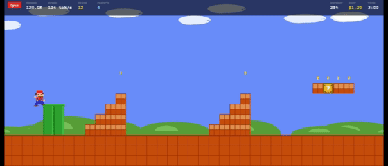
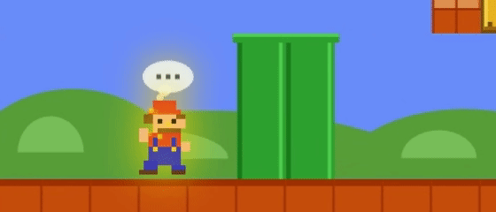
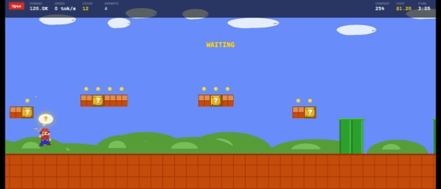
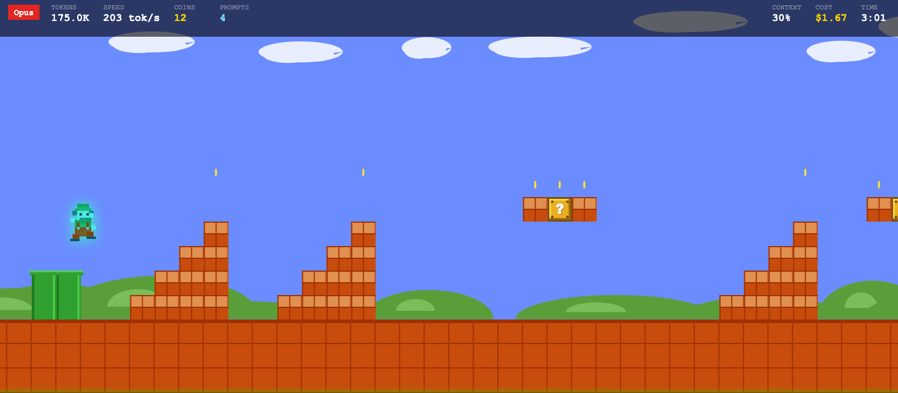
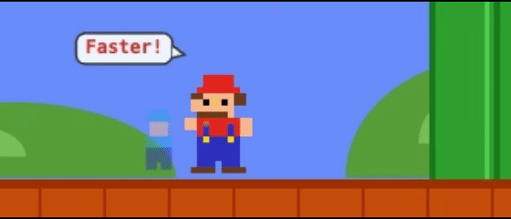
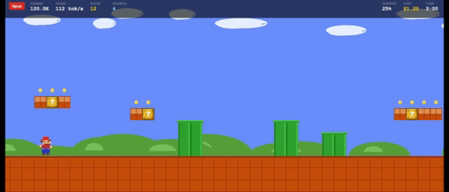
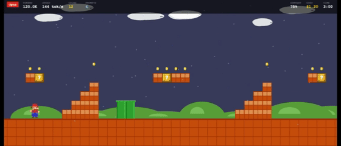
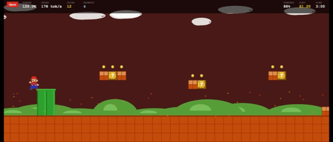
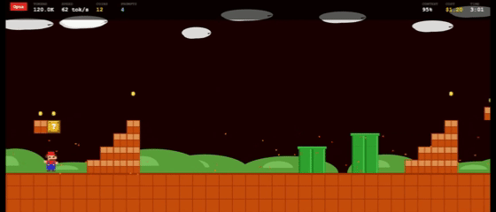

# Claude Arcade

> Arcade games for Claude Code — auto-playing pixel games driven by real-time token usage.

This repo is both a **plugin** (`plugins/claude-arcade/`) and a **plugin marketplace** (`.claude-plugin/marketplace.json`). You can install it with one command — see below.

Watch your tokens come to life. While Claude Code runs, the character runs, jumps, and collects coins. While Claude thinks, the character charges up. While Claude waits for your input, a `?` block appears.

---

## Games

Claude Arcade is built to host **multiple arcade games** for Claude Code — each one a tiny pixel game whose visuals are driven entirely by what's happening in your live session (tokens, prompts, tools, context pressure, etc.). Right now it ships with one:

### Super Mario Runner

An auto-playing side-scroller. You don't control Mario — your Claude Code session does. Token throughput becomes his running speed, thinking becomes a glow, prompts become jumps, subagents become tiny tinted sidekicks, and a filling context window literally rains and burns down the level. Each cell below is a distinct in-game state and **when it triggers**.

<table>
  <tr>
    <td width="33%" valign="top" align="center">
      <br/>
      <strong>Normal gameplay</strong><br/>
      <sub>Tokens are flowing — Mario walks/runs/sprints based on tok/s, HUD numbers tick up</sub>
    </td>
    <td width="33%" valign="top" align="center">
      <br/>
      <strong>Thinking</strong><br/>
      <sub>Claude is processing (no tokens yet) — Mario glows and a <code>…</code> thought bubble appears</sub>
    </td>
    <td width="33%" valign="top" align="center">
      <br/>
      <strong>Waiting for your input</strong><br/>
      <sub>Claude is waiting on your reply — <code>?</code> block appears, character taps foot, tab title flashes</sub>
    </td>
  </tr>
  <tr>
    <td valign="top" align="center">
      <br/>
      <strong>Token burst</strong><br/>
      <sub>First big chunk of output after thinking — speed boost with a star streak</sub>
    </td>
    <td valign="top" align="center">
      <br/>
      <strong>Subagent spawn</strong><br/>
      <sub>Every time Claude spawns a subagent, a small tinted Mario joins the level and runs alongside the main one</sub>
    </td>
    <td valign="top" align="center">
      <br/>
      <strong>Task complete</strong><br/>
      <sub>Claude finishes a task or turn — fireworks celebration, coin counter pops</sub>
    </td>
  </tr>
  <tr>
    <td valign="top" align="center">
      <br/>
      <strong>Context 60% — rain</strong><br/>
      <sub>Context window passes 60% — sky darkens, rain starts</sub>
    </td>
    <td valign="top" align="center">
      <br/>
      <strong>Context 80% — fire</strong><br/>
      <sub>Context window passes 80% — red sky, fire embers drifting</sub>
    </td>
    <td valign="top" align="center">
      <br/>
      <strong>Context 90% — shake</strong><br/>
      <sub>Context window passes 90% — screen shakes, time to clear context</sub>
    </td>
  </tr>
</table>

---

## Install (recommended)

Add the marketplace, then install the plugin. From inside any Claude Code session:

```
/plugin marketplace add jaipatel248/claude-arcade
/plugin install claude-arcade@claude-arcade
```

That's it. Run the game with:

```
/claude-arcade:super-mario-runner
```

Pick a different port if `3248` is busy:

```
/claude-arcade:super-mario-runner 4000
```

### Updating

```
/plugin marketplace update claude-arcade
```

### Uninstalling

```
/plugin uninstall claude-arcade@claude-arcade
/plugin marketplace remove claude-arcade
```

---

## Local development install

Without going through the marketplace — useful when iterating on the plugin source:

```bash
git clone https://github.com/jaipatel248/claude-arcade.git
claude --plugin-dir ./claude-arcade/plugins/claude-arcade
```

After editing files, run `/reload-plugins` inside the session to pick up changes without restarting.

---

## How it maps Claude → Mario

| Claude activity | Game effect |
|---|---|
| Tokens flowing fast | Character sprints |
| Tokens flowing slow | Character walks |
| Idle | Character stands still |
| Thinking (processing) | Glow + thought bubble (`...`) |
| Token burst after thinking | Speed boost with star effect |
| Waiting for your input | `?` block appears, character taps foot, tab title flashes |
| You answer | `?` block bursts into coins |
| Task complete | Fireworks |
| Context window 60%+ | Sky darkens, rain |
| Context window 80%+ | Red sky, fire embers |
| Context window 90%+ | Screen shakes |
| Cost increases | Coin counter goes up |

**HUD:** Tokens (in/out), Speed (tok/s), Coins, Prompts, Context %, Cost ($), Session time, Model badge.

**Keyboard:** `Space` jump · `M` toggle music · `S` toggle SFX · `C` screenshot.

---

## How it works

```
Claude Code session
  ─► hooks (PreToolUse, PostToolUse, Stop, …) call scripts/collect.js
  ─► collect.js writes events to ~/.claude/token-graph-live.jsonl
  ─► scripts/super-mario-runner.js tails the JSONL file
  ─► pushes updates to the browser via Server-Sent Events
  ─► browser renders the game at 60fps (Canvas + pixel art)
```

The launch script forks itself into the background on first run (cross-platform — no shell backgrounding tricks needed) and binds an HTTP server on the chosen port. Subsequent invocations on the same port just reopen the browser tab.

---


## Repo layout

```
claude-arcade/
├── .claude-plugin/
│   └── marketplace.json            ← Marketplace catalog
├── plugins/
│   └── claude-arcade/
│       ├── .claude-plugin/
│       │   └── plugin.json         ← Plugin manifest
│       ├── hooks/
│       │   └── hooks.json          ← Registers statusLine + Claude Code hooks
│       ├── scripts/
│       │   ├── collect.js          ← Hook receiver → JSONL writer
│       │   └── super-mario-runner.js ← Game server (HTTP + SSE)
│       ├── skills/
│       │   └── super-mario-runner/SKILL.md   ← /claude-arcade:super-mario-runner
│       └── webview/
│           ├── super-mario-runner.html
│           ├── js/                 ← Game modules
│           └── sounds/
├── docs/
│   └── images/                     ← README screenshots (01-running.png … 09-shake.png)
├── LICENSE                         (MIT)
└── README.md
```

## Requirements

- Claude Code (`claude` CLI)
- Node.js 16+ (already required by Claude Code)
- A modern browser
- Zero npm dependencies — uses only Node built-ins

## Server controls

Start (default port 3248):
```
node plugins/claude-arcade/scripts/super-mario-runner.js
```

Pick a port:
```
node plugins/claude-arcade/scripts/super-mario-runner.js --port 4000
```

Check status:
```
node plugins/claude-arcade/scripts/super-mario-runner.js --status --port 4000
```

Stop a running instance:
```
node plugins/claude-arcade/scripts/super-mario-runner.js --stop --port 4000
```

Run in foreground (for debugging):
```
node plugins/claude-arcade/scripts/super-mario-runner.js --foreground
```

## Debug logging

Set `CLAUDE_ARCADE_DEBUG=1` before launching Claude Code to dump every hook payload to `${TMPDIR}/claude-arcade-debug.jsonl`. Off by default.

## License

[MIT](LICENSE)

## Credits

Built by [Jay Patel](https://github.com/jaipatel248). Pull requests welcome.
